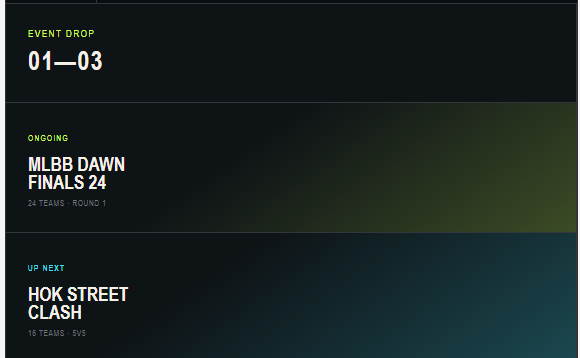

# Miracle UI v3 — Latest decision snapshot

**Snapshot date:** 2026-09-05
**Current status:** UI brainstorming paused for the night. Three organizer-facing interactive mockups are approved. No production implementation has been authorized.
**Resume tomorrow:** Captain journey for direct paid registration through Miracle, from the public event CTA through evidence upload and visible status.

## Authority

This section is the latest concise handoff. It supersedes older entries below wherever they conflict. Preserve the older sections as history rather than current direction.

## Approved tonight

1. **Contextual event-creation wizard** — approved. Five stages with live public preview, local prototype persistence, visible guidance, Montserrat, dark default, remembered organizer theme toggle, logo-led palette, separate logo/poster, explicit registration window, and prominent organizer contact.
2. **Draft Event Workspace / Ringkasan** — approved. The next action and readiness checklist lead; each issue returns to the correct wizard step. Supporting facts, preview, and simulated review-link controls remain easy to reach.
3. **Registrasi and external import** — approved. Direct Miracle entries and spreadsheet imports share one organizer surface while retaining distinct source and payment semantics. Payment review uses a side panel with required rejection reason.
4. **Import review** — approved. XLSX/CSV intake, worksheet and column review, New/Changed/Same/Error classifications, detailed row inspection, selective import, history, and captain access remain part of the flow.
5. **Pagination** — required and approved. Default 25; 10/25/50 controls above and below the table; filters run before pagination; original source rows remain visible; page-only header selection is explicit; row selections and totals persist across pages and filters.

## Durable references

- `public/miracle-organizer-v3-contextual-mockup.html`
- `public/miracle-organizer-v3-workspace-mockup.html`
- `public/miracle-organizer-v3-registration-mockup.html`
- `docs/snapshots/product-ux-redesign-2026-09/ui-v3-workspace-checkpoint.md`
- `docs/snapshots/product-ux-redesign-2026-09/registration-import-v3-direction.md`
- Miracle brand assets remain under `public/logo/`.

The standalone mockups use local/session simulation. They do not modify production events, payments, users, credentials, or imported teams. `public/miracle-mockup-exceljs.min.js` and its license support local XLSX reading in the registration prototype.

## Locked visual direction

- Miracle logo is the color authority.
- Three brand accents: cyan, violet, cream; dark/neutral surfaces provide functional contrast.
- Avoid neon glow and visually painful saturation.
- Montserrat is the primary UI family.
- Dark default globally; organizer remembers light/dark preference.
- Thin separators and sidebar organize work. Guidance is contextual and UI copy must explain the next action.
- Public footer retains © Miracle plus clearly labeled contact/social links on complete public pages.

## Production facts preserved

- Existing event statuses and ownership remain the operational baseline.
- Direct team registration is status-gated by Published and includes capacity, duplicate, payment, and bracket-result guards.
- Existing paid registration uses evidence submission/review; existing imports create/update teams and can create captain access.
- Import supports XLSX/CSV, not legacy XLS, and is blocked by the existing bracket lock.
- Imported source does not equal verified payment.
- Roster editing locks during Ongoing and Finished.
- Current schedule/location values are strings; structured registration/start dates, timezone behavior, draft autosave, review links, and publish-readiness enforcement still require production design/implementation.

## Immediate next task

Create the direct Miracle registration experience for a captain using a paid event. Cover event-page CTA, auth return, choose/create team, roster review, fee summary, payment instructions/evidence, pending-review confirmation, rejection recovery, and approved state. After registration, replace the CTA with “Lihat pendaftaran saya”. Connect these states to the approved organizer Registrasi list.

Do not begin production implementation yet. Continue brainstorming, get the captain-flow design approved, then consolidate the complete design specification and implementation plan.

---

## Previous snapshot history

# Miracle League Product & UX Redesign — Latest Decision Snapshot

**Snapshot date:** 2026-09-04
**Status:** Direction approved in part; brainstorming paused before the field-level wizard specification.
**Current working record:** [plan.md](./plan.md)

> **Authority notice:** This section records the latest user decisions and supersedes the August 2026 street-sport/neon visual direction wherever they conflict. The earlier snapshot remains below as historical context and implementation evidence. Do not resume the old neon direction, Teko/Chakra Petch typography, or public-only scope without a new explicit user decision.

## Current product diagnosis

Miracle League is functional but has been judged **very uninformative**. The problem spans the whole product: content hierarchy, navigation, layout, components, onboarding, and visual consistency. A color swap or isolated homepage facelift will not solve it.

The redesign now covers three connected experiences in this priority order:

1. **Organizer / prospective organizer** — primary user and future premium customer.
2. **Public visitor / participant** — must immediately understand the product, find an event, understand it, and know the next action.
3. **Captain** — needs an efficient operational flow for registration, roster, payment, and statistics.

The full redesign is intentionally larger than the public-only scope recorded in the old snapshot. It will be decomposed into separate specifications and implementation phases rather than delivered as one uncontrolled rewrite.

## Consolidated user feedback

The user asked for these changes during the September redesign discussion:

- Center page titles where the context benefits from a focused heading.
- Center the “Event” label in the public navbar.
- Replace the current admin typography with a common, readable family.
- Add a Miracle League logo and distinguish it from event logos.
- Add an initial guide/onboarding, user journeys, and contextual tooltips.
- Consider borders and a sidebar to make page regions and navigation clearer.
- Rework the layout and component system comprehensively.
- Remove neon because it is uncomfortable to look at.
- Limit the brand palette to three functional colors.
- Use Color Hunt as the color reference and hellodesign.id as a reference for restrained spacing, hierarchy, bordered cards, responsive grids, and a clear primary action.
- Make event descriptions substantially more informative.
- Add footer copyright, contact information, and labeled social links.
- Improve every component family and its active, disabled, loading, success, warning, and error states.

## Product priority and success criteria

The user confirmed organizer → public → captain as the priority. All audiences remain first-class parts of the product.

The organizer's first success moment is:

> Create an event easily, keep it as a safe draft, see exactly how it will appear publicly, understand what can be customized, and publish it when the minimum information is complete.

This organizer-first foundation must preserve a path to future premium capabilities such as advanced branding, larger events, staff permissions, automation, reports, custom domains, and priority support. Those features are not automatically in the first implementation phase.

## Approved organizer creation model

The user selected **A — wizard with live preview**.

- The event-creation flow is a dedicated wizard, not the organizer's primary navbar.
- The organizer shell contains Dashboard, Event Saya, Buat Event, Panduan & Bantuan, and Pengaturan.
- On desktop, the wizard places the form on the left and live public preview on the right.
- On mobile, preview opens through a dedicated action.
- The organizer may revisit previous steps without losing information.
- Draft creation begins with the first meaningful input.
- Draft data is always autosaved.
- The UI shows “Menyimpan…”, “Draft tersimpan”, and the last saved time.
- Saving and previewing are never blocked.
- Publishing is blocked until the minimum public information is valid.
- Once a draft exists, it appears in Event Workspace for long-term operation.

The current five-step proposal is:

1. **Identitas** — event name, game, short description, and square event logo.
2. **Format & Jadwal** — mode, tournament system, capacity, date, time, timezone, and location/platform.
3. **Registrasi** — registration period and method, fee/free state, eligibility, and organizer contact.
4. **Halaman Publik** — prize/no-prize state, full description, rules, portrait poster, and branding.
5. **Tinjau & Terbitkan** — readiness checklist, full preview, review link, validation, and publish action.

This sequence is directionally accepted through the approved organizer mockup. Exact fields, ordering, validation, and help copy remain the first topic for the next brainstorming session.

## Minimum publishable event

Publishing remains disabled until the event contains:

- event name and short description;
- game, format, and participant capacity;
- date, time, and timezone;
- physical location or online platform;
- registration period and method;
- fee or explicit “free” state;
- prize or explicit “no prize” state;
- organizer contact;
- event logo or a valid visual fallback.

Full rules, rundown, sponsors, livestream, and FAQ may be added after the initial draft. The readiness checklist must clearly expose missing information.

## Draft review link approved for the initial design phase

The user approved a draft review link that opens without login.

- It is an unlisted, hard-to-guess URL.
- It is excluded from event listings and search indexing.
- It is view-only and cannot be used to edit or register.
- It carries a prominent “Preview draft—belum dipublikasikan” label.
- It exposes no internal organizer, participant, payment, or admin data.
- The organizer can revoke or regenerate it at any time.

## Event Workspace boundary

The wizard creates and prepares the event. Event Workspace operates it after a draft exists.

Proposed workspace areas:

- Ringkasan
- Halaman Publik
- Registrasi
- Peserta
- Pertandingan
- Hasil
- Pengaturan

Bracket, standings, leaderboard, statistics review, and certificates belong to the relevant operational areas rather than the creation wizard.

## Latest visual direction

### Typography

The user selected **Montserrat** as the primary font after comparing Plus Jakarta Sans, Roboto, and Montserrat. The older Teko/Chakra Petch pairing is no longer the target for the redesign.

### Functional three-color palette

Current candidate from Color Hunt:

- `#F9F7F7` — page background and light surfaces.
- `#112D4E` — primary text, dark navigation, and strong identity regions.
- `#3F72AF` — primary actions, links, progress, and active state.

Neon is rejected. The treatment should feel calm, clear, and comfortable over long organizer sessions. Semantic success, warning, and error colors still require an explicit rule so they do not undermine the three-color constraint.

### Layout and component language

- Use generous whitespace and strong information hierarchy.
- Use thin borders and a stable sidebar to clarify structure.
- Keep one primary action per decision area.
- Use a consistent spacing, radius, type, icon, and component-state system.
- Center only the headings whose context benefits from it; long-form content remains scan-friendly.
- Provide onboarding, helper copy, tooltips, empty states, and visible progress where users would otherwise lose direction.

## Event logo and poster decisions

The logo and poster are separate assets with separate jobs:

- **Event logo:** square 1:1 identity asset uploaded during Identitas.
- **Event poster:** portrait 4:5 promotional asset uploaded during Halaman Publik.
- The wizard provides preview, size guidance, crop/focal controls, and fallbacks.
- The poster appears on the right of the desktop event hero and before the summary on mobile.
- The poster supplies event-card imagery through a controlled crop.

The first logo-placement exploration was rejected as too busy. The approved simplification is:

- one event title only;
- a small event logo as a secondary identity marker;
- organizer name as secondary copy;
- one short event description and one primary CTA;
- poster on the right as supporting promotional art;
- date, location, fee, and prize moved into a metadata row below the hero;
- full event detail and rules placed after the hero.

The user explicitly approved this quieter density: “Nah lebih baik, oke bungkus yg ini.”

## Durable visual artifact register

| Artifact | Status | Decision captured |
|---|---|---|
| [organizer-first-event-layout.html](./docs/snapshots/product-ux-redesign-2026-09/organizer-first-event-layout.html) | **A selected** | Wizard with persistent live preview is the event-creation foundation. |
| [organizer-wizard-workspace-approved.html](./docs/snapshots/product-ux-redesign-2026-09/organizer-wizard-workspace-approved.html) | **Direction approved** | Separation between event-creation wizard and long-term Event Workspace; updated to Montserrat for this durable copy. |
| [font-poster-comparison.html](./docs/snapshots/product-ux-redesign-2026-09/font-poster-comparison.html) | **Montserrat selected** | Font comparison and initial 4:5 poster placement. |
| [event-logo-placement-too-busy.html](./docs/snapshots/product-ux-redesign-2026-09/event-logo-placement-too-busy.html) | **Rejected as too busy** | Do not repeat the event name or make logo, poster, metadata, and title compete inside the hero. |
| [event-hero-simplified-approved.html](./docs/snapshots/product-ux-redesign-2026-09/event-hero-simplified-approved.html) | **Approved** | Latest event hero density, hierarchy, logo scale, poster role, and metadata placement. |

These HTML files are brainstorming references, not production components. They establish hierarchy and composition; production work must still define responsive behavior, accessibility, data states, and implementation boundaries.

## Public information requirements

The public event experience must explain:

- event purpose and intended participant;
- schedule, timezone, and location/platform;
- competition format and important rules;
- participant requirements and registration steps;
- registration fee, prize, and deadline;
- organizer identity and contact;
- current registration/event status;
- the next available action.

The footer includes current-year copyright, contact channels, and labeled social links. Public navigation must make Event discovery obvious, and the entire public journey must be understandable without prior product knowledge.

## Planned redesign sequence

1. Finalize information architecture and user journeys for organizer, public, and captain.
2. Define the Montserrat-based design system, three-color tokens, spacing, grid, icons, components, states, and accessibility patterns.
3. Specify and implement the first-event wizard, autosave, preview, validation, and draft review link.
4. Specify and implement Event Workspace.
5. Redesign homepage, event listing, event detail, registration, participants, bracket, standings, and leaderboard.
6. Redesign captain workflows.
7. Add onboarding, contextual help, tooltips, empty states, footer, and support paths.
8. Verify responsive, keyboard, contrast, failure, and end-to-end behavior before staged rollout.

## Resume point

The next session starts by validating the five wizard steps field by field. Then decide:

1. per-step behavior, validation, helper copy, and preview mapping;
2. semantic-color policy under the three-color brand limit;
3. Event Workspace information architecture;
4. public journey from landing → event discovery → event comprehension → registration;
5. captain journey;
6. the complete design sections and approval;
7. final design spec under `docs/superpowers/specs/`, followed by an implementation plan only after explicit review.

---

# Historical Snapshot — Public Visual Redesign (August 2026)

The content below records the previous design and implementation effort. It remains valuable as evidence about unsuccessful implementation fidelity, performance work, asset provenance, and existing code, but its neon/street-sport visual direction and public-only scope are superseded by the September 2026 decisions above.
# Miracle Public Redesign — Conversation and Decision Snapshot

**Snapshot date:** 2026-08-22

**Status:** Approved direction. Partially implemented — see [Implementation outcome](#implementation-outcome--2026-08-22) before continuing.

**Primary implementation plan:** [plan.md](./plan.md)

**Authoritative design specification:** [docs/superpowers/specs/2026-08-22-public-visual-system-and-ai-event-art-design.md](./docs/superpowers/specs/2026-08-22-public-visual-system-and-ai-event-art-design.md)

## Purpose of this document

This file preserves the design conversation behind Miracle's public visual redesign so another agent can continue without flattening the work into a generic gaming landing page.

It contains:

- the user's original feedback and follow-up messages;
- the decisions made after each round;
- the visual experiments and their approval status;
- the final visual, product, performance, and AI-asset constraints;
- explicit rejected directions and implementation guardrails.

This is a **decision-complete conversation snapshot**, not a byte-for-byte export of internal tool calls. User messages below are quoted verbatim where available. Short choices made through the brainstorming UI are recorded as decisions, not reconstructed as quotations. Automatically supplied browser context, tool logs, and system instructions are deliberately excluded because they were not user requests.

---

## Executive summary

The public Miracle experience currently feels functional but visually generic: a familiar SaaS page structure wearing a gaming skin. The agreed redesign is not a full product rebrand. It is a focused public-facing system for the homepage, event listing, and event detail.

The selected direction is **game-skinned street sport**:

- a near-black canvas with warm off-white text;
- one dominant acid-lime Miracle accent;
- condensed athletic event wordmarks;
- restrained halftone, grain, scan-line, and xerox texture;
- poster-like composition, match ticker, issue numbering, and clipped geometry;
- one expressive gesture per composition rather than simultaneous glitch, outline, rotation, neon, and texture effects;
- one strong event artwork reused through responsive crops, with a deterministic typographic fallback;
- original AI-generated, genre-inspired artwork only after creation, storage, and organizer approval;
- no runtime scraping, hotlinking, or random images from the internet.

The closest approved composition is [`combined-homepage-v2.html`](./docs/snapshots/public-visual-redesign/combined-homepage-v2.html). The chosen typographic silhouette is **A — condensed athletic** in [`letterform-silhouettes.html`](./docs/snapshots/public-visual-redesign/letterform-silhouettes.html).

---

## Conversation chronology

### 1. Initial problem: the public homepage feels lifeless

> "Halaman depan public miracle masih terasa seperti AI slop, tanpa rasa, gak hidup. Kalo aku pengen ubah ke mood board semacam ini, https://gamizio-pq.webflow.io/ gimana menurutmu? apakah perubahannya sangat massive? apakah diperlukan dalam waktu dekat? atau kita fokus dulu ke fungsional?"

The response identified that the problem was not a missing gradient, illustration, or animation. The current page used a recognizable default product-marketing grammar: clean card grids, rounded containers, abstract decorative art, generic headings, and predictable hero hierarchy. Replacing colors alone would keep the same lifeless structure.

The Gamizio reference was useful for its design DNA rather than as a template to copy:

- near-black background;
- acid accent;
- oversized display typography;
- clipped or cut-corner geometry;
- technical rules and framing;
- dominant event/game artwork;
- the feeling of a broadcast poster rather than a SaaS landing page.

Scope assessment made during this round:

- a homepage-only facelift is moderate, roughly 2–4 focused days;
- a consistent homepage, event listing, and event detail system is roughly 1–2 weeks;
- extending the redesign into organizer, captain, and operational screens would become a 3–6 week rebrand and is not currently justified;
- for a pitch/demo, public polish is part of the product proof, but the redesign should remain independently shippable and must not block tournament functionality.

### 2. First visual directions were rejected

> "tidak ada yg cocok, aku masih melihat design tersebut belum terasa hidup, masih AI slop"

The first exploration is preserved in [`visual-direction.html`](./docs/snapshots/public-visual-redesign/visual-direction.html).

The important diagnosis from the rejection was:

- the options were still a SaaS information architecture with decorative gaming styling;
- the layouts looked designed by assembling current UI trends rather than by expressing a specific tournament culture;
- cards, gradients, glow, and interchangeable illustration treatment did not create identity;
- “more effects” was not the answer.

The direction pivoted from “gaming landing page” to **street tournament / sporty neon / street-sport futurist**. The homepage should behave like the poster for the featured event, and its game skin should change with the featured event without losing the Miracle brand.

### 3. The game-skinned street-sport direction became the first real breakthrough

The second exploration is preserved in [`street-sport-game-skin.html`](./docs/snapshots/public-visual-redesign/street-sport-game-skin.html).

This direction was materially closer because it introduced:

- an event-first hero rather than a platform-marketing hero;
- condensed competitive display type;
- match and issue metadata;
- a darker, flatter canvas;
- more editorial asymmetry;
- a featured-game skin contained by a persistent Miracle frame.

This was a **directional approval**, not final approval. The main remaining weakness was the presentation of event names.

### 4. Event rail needed physical texture and specificity

The user supplied this screenshot as the concrete target area:



> "oke ini lebih dekat, tapi bagian nama2 event masih terasa generik, tanpa ada seperti tekstur? kayanya kita butuh itu"

The event rail was revised into poster fragments in [`textured-event-rail.html`](./docs/snapshots/public-visual-redesign/textured-event-rail.html), adding:

- subtle halftone/xerox fields;
- cropped framing;
- issue or drop numbers;
- ghost type and background letterforms;
- controlled variation between events;
- texture as atmosphere rather than a bitmap pasted over the whole card.

Approval status: **texture concept approved; typography not approved**.

### 5. Texture worked, but the event-name typography still felt generic

> "Teksturnya menarik, tapi tipografi nya belum mencapai apa yang aku inginkan, masih terlalu generik"

The key decision was to stop treating an event name as an ordinary heading. Each name should read like a small wordmark while remaining real, selectable DOM text.

Three expressive wordmark systems were explored in [`typography-directions.html`](./docs/snapshots/public-visual-redesign/typography-directions.html).

### 6. The three typography concepts overcorrected

> "ketiganya terlalu kontras, yang baca pasti akan pusing"

The problem was not merely color contrast. Too many devices were active simultaneously: outline, skew, glitch, split color, rotation, texture, and competing weights. The refinement rule became:

> **One wordmark. One main text color. One signature gesture. One neon accent.**

The typography was reduced to silhouette and rhythm in [`letterform-silhouettes.html`](./docs/snapshots/public-visual-redesign/letterform-silhouettes.html):

- **A — Condensed Athletic**
- B — Angular Tech
- C — Extended Geometric

The user selected **A — Condensed Athletic** as the closest direction.

### 7. Condensed Athletic was merged back into the textured homepage

> "oke A mendekati apa yang aku mau, coba gabungkan dengan desain tadi"

The merged result is preserved in [`combined-homepage-v2.html`](./docs/snapshots/public-visual-redesign/combined-homepage-v2.html).

It combines:

- the game-skinned street-sport homepage;
- the approved condensed athletic wordmark silhouette;
- the textured event rail;
- restrained use of lime and secondary game color;
- poster composition without making every block compete for attention.

Approval status: **approved foundation and implementation direction**. This is the primary visual reference for implementation, not a pixel-perfect contract.

### 8. Performance and asset sourcing became the next concern

> "Arahnya sudah lumayan, tapi apakah performa nya tidak akan menjadi korban mengingat begitu banyak asset yg kita gunakan nanti? lalu untuk asset2 ini, kamu yg generate otomatis sesuai game dengan mengambil data acak yg sudah bertebaran di internet sbg fallback (organizer harus tetep bisa upload) atau gmn?"

The answer established two non-negotiable principles:

1. The appearance of many layers must not translate into many heavy bitmap downloads.
2. Miracle must never scrape, hotlink, or select random internet images as a fallback.

Performance direction:

- load at most one prioritized full-width artwork in the initial homepage viewport;
- reuse one landscape master artwork for hero, tiles, and detail through responsive crops;
- lazy-load below-the-fold images;
- use optimized AVIF/WebP delivery through `next/image` and Blob/CDN storage;
- build grain, scan lines, halftone, rules, masks, and clipped geometry with CSS or tiny SVG assets;
- keep the event name, status, metadata, and actions as HTML text rather than baking them into art.

Accepted byte budgets:

- homepage hero: at most **300 KB desktop** and **200 KB mobile**;
- displayed event tile: at most **120 KB**;
- total decorative texture: at most **10 KB**;
- only the hero may use priority loading.

Asset-source decision:

- organizers retain upload control;
- organizer-uploaded official game/character art requires an explicit rights attestation;
- when an organizer has no artwork, Miracle may generate an original genre-inspired visual;
- generated art must avoid named heroes, official logos, trademarks, UI text, or close character likenesses;
- generation happens once in the background, never when a visitor opens a public page;
- the result is stored as a revision and must be approved by an organizer before becoming public;
- until approval, the page uses the existing approved artwork or a deterministic typographic poster fallback.

### 9. Product and infrastructure decisions were finalized

The following choices were captured during the structured brainstorming steps:

- phase-one surfaces: homepage, event listing, and event detail;
- bracket, participants, leaderboard, and standings remain calmer, data-first surfaces and inherit only the shell, palette, display type, and event header;
- organizer and captain interfaces are outside the public visual redesign;
- AI image provider: **GPT Image 2**, behind a provider adapter;
- durable async execution: **Vercel Workflow**;
- each generated or uploaded visual is an `EventVisualAsset` revision;
- public rendering follows `Event.activeVisualAssetId` and only displays an approved revision;
- organizer generation limit: three attempts per event in a rolling 24-hour window;
- a platform admin may override the limit;
- feature flags: `public_visual_v2` and `ai_event_art`, independently reversible and off by default;
- initial pitch-ready target: 1–2 weeks, with the public visual milestone shippable before the AI milestone.

All four design-spec sections presented after this were approved.

### 10. Design specification requested and produced

> "lanjut"

The approved design was written to:

- [`docs/superpowers/specs/2026-08-22-public-visual-system-and-ai-event-art-design.md`](./docs/superpowers/specs/2026-08-22-public-visual-system-and-ai-event-art-design.md)

Recorded commit:

- `5dae7b8` — design specification

### 11. Claude implementation plan requested and produced

> "buatkan plan.md nya dong, agar aku bisa berikan ke claude untuk di eksekusi lebih lanjut"

The executable plan was written to:

- [`plan.md`](./plan.md)

It divides the work into:

- Milestone A — pitch-ready public visual system;
- Milestone B — organizer visual revisions;
- Milestone C — reviewed AI generation;
- Release gate — accessibility, performance, rollback, and regression verification.

Recorded commit:

- `f45d1ac` — implementation plan

### 12. Conversation snapshot requested

> "sekaligus buat snapshot.md nya dong yg berisi semua percakapan kita, contoh2 visual yg sudah aku approve, dan lain lainnya dong"

This document and the files under [`docs/snapshots/public-visual-redesign/`](./docs/snapshots/public-visual-redesign/) are the result.

---

## Visual artifact register

| Artifact | Status | What it proves | What Claude must do with it |
|---|---|---|---|
| [`visual-direction.html`](./docs/snapshots/public-visual-redesign/visual-direction.html) | **Rejected** | The first options remained generic SaaS with gaming decoration. | Use only as a negative reference. Do not rebuild these compositions. |
| [`street-sport-game-skin.html`](./docs/snapshots/public-visual-redesign/street-sport-game-skin.html) | **Directionally approved** | The event-first, street-sport, game-skinned pivot felt more alive. | Preserve its event energy and editorial hierarchy, then apply later refinements. |
| [`event-rail-user-reference.png`](./docs/snapshots/public-visual-redesign/event-rail-user-reference.png) | **User-supplied diagnosis** | The event-name area that still felt generic. | Use to understand the specific region and problem, not as a final target. |
| [`textured-event-rail.html`](./docs/snapshots/public-visual-redesign/textured-event-rail.html) | **Partially approved** | Halftone/xerox/poster texture improved the event rail. | Keep the texture logic; replace its generic event typography with the approved wordmark system. |
| [`typography-directions.html`](./docs/snapshots/public-visual-redesign/typography-directions.html) | **Rejected as a set** | Too many simultaneous effects made reading tiring. | Treat as a record of what not to combine. Do not select one wholesale. |
| [`letterform-silhouettes.html`](./docs/snapshots/public-visual-redesign/letterform-silhouettes.html) | **A approved** | “A — Condensed Athletic” is the selected event-name silhouette. | Use A as the typographic base. B and C are not selected. |
| [`combined-homepage-v2.html`](./docs/snapshots/public-visual-redesign/combined-homepage-v2.html) | **Approved direction** | The best combination of game skin, restrained texture, condensed type, and poster energy. | Treat as the primary visual reference while following the spec and budgets. |

The HTML files are preserved brainstorming fragments, not production components. They may contain remote reference artwork or presentation-only wrapper assumptions. They define visual intent; they do not override the production architecture, licensing rules, responsive behavior, accessibility requirements, or the implementation plan.

---

## Approved visual language

### Brand character

Miracle should feel like an active community tournament with the graphic confidence of a street-sport poster. It should not feel like an esports template marketplace, cyberpunk dashboard, generic SaaS homepage, or AI-generated mood-board collage.

Three layers should remain distinct:

1. **Miracle frame:** persistent palette, typography, geometry, numbering, navigation, and metadata system.
2. **Event skin:** featured game's palette, artwork, tournament title, and format.
3. **Live data:** status, match timing, teams, bracket entry points, participants, and standings.

Changing the featured game may change the secondary mood, but the product must still be recognizably Miracle.

### Color

- Canvas: `#080c0e`
- Primary text: `#f3f0e8`
- Dominant Miracle accent: `#caff38`
- One small game-specific secondary accent is allowed where it has a clear role.
- Status colors are functional and should remain locally contained.
- Do not create rainbow neon hierarchy.

### Typography

- Event wordmarks and large numerals: **Teko 600/700**.
- Navigation, metadata, controls, and body copy: **Chakra Petch 500/600/700**.
- Self-host the font files in production.
- Event titles use the **Condensed Athletic** silhouette.
- The wordmark remains readable text in the DOM.
- Expressiveness comes primarily from scale, crop, line breaks, spacing, and one signature gesture—not stacked visual effects.

### Texture and composition

- Use low-opacity CSS/SVG grain, halftone, scan lines, poster framing, and clipped geometry.
- Texture should give physical presence without dirtying every surface.
- One region may be loud; neighboring information regions should be calm.
- Use controlled asymmetry, not random misalignment.
- Reuse issue numbers, event-drop numbering, and match ticker language as a recognizable system.
- Avoid a grid of identical rounded cards.

### Imagery

- One strong landscape master image is preferred over many unique assets.
- Art direction should be original and genre-inspired.
- The HTML/UI owns all essential copy and calls to action.
- The visual must still work with no generated or uploaded artwork by using the typographic fallback.

### Motion

No motion style was approved that requires heavy animation. If motion is added during implementation, it must be restrained, respect `prefers-reduced-motion`, and never be necessary to understand status or navigate. A static poster composition is the baseline.

---

## Explicitly rejected patterns

Claude must not “improve” the approved direction by reintroducing these:

- generic gradient hero sections;
- interchangeable gaming illustrations with no connection to the event;
- repeated rounded cards as the main page grammar;
- glassmorphism as the primary identity;
- several neon accents competing at equal strength;
- glitch + outline + skew + rotation + texture on the same wordmark;
- baking event names, statuses, or CTA text into generated images;
- using official game characters as an automatic fallback;
- scraping, hotlinking, or randomly selecting art from the internet;
- triggering image generation during a public page request;
- publishing AI art without organizer review;
- applying dense poster treatment to tables, bracket views, or admin workflows;
- redesigning organizer/captain surfaces in phase one;
- making the AI integration a prerequisite for shipping the public visual system.

---

## Final product decisions

### Phase-one route scope

In scope:

- public homepage;
- public event listing;
- public event detail.

Inherited but deliberately calmer:

- bracket;
- participants;
- leaderboard;
- standings.

Out of visual-redesign scope:

- organizer workspace;
- captain workspace;
- general admin interface, except the new event-visual management controls required by the asset workflow.

### Primary user experience

- Audience: players and gaming communities.
- Homepage behavior: the current featured event's poster.
- Primary CTA: enter/explore a real event, not read generic platform marketing.
- Event listing: poster slices with scan-friendly filters.
- Event detail: a full event skin with direct access to tournament data.

### Visual source precedence

Resolve public artwork in this order:

1. approved asset referenced by `activeVisualAssetId`;
2. legacy `gameImageUrl` during migration;
3. deterministic typographic poster derived from the event name, initials, game palette, and format.

An AI-generated revision that is still generating, ready for review, rejected, or failed is never public.

---

## Final AI artwork decisions

### Allowed

- Original genre-inspired character or scene.
- Organizer-provided event metadata from a strict allowlist.
- Server-side generation through a provider adapter.
- GPT Image 2 as the first provider implementation.
- Stored revisions with review and rollback.
- Safe retry behavior in Vercel Workflow.

### Prohibited

- Named official heroes or characters in prompts.
- Game logos, publisher marks, trademarks, or UI text in generated art.
- Close imitation of a recognizable official character.
- Participant, captain, contact, or other personal data in prompts.
- Runtime internet image search as fallback.
- Browser-side provider calls.
- Automatic publication after generation.

### Lifecycle

1. Organizer creates or edits an event.
2. Organizer may upload artwork or request generation.
3. A durable workflow creates the AI revision once and stores the normalized image.
4. Status becomes `ready_for_review`.
5. Organizer approves or rejects it.
6. Approval atomically moves `activeVisualAssetId` to that revision.
7. Older approved revisions remain available for rollback.

### Revision states

- `generating`
- `ready_for_review`
- `approved`
- `rejected`
- `failed`

### Operational controls

- three organizer generation attempts per event per rolling 24 hours;
- platform-admin override;
- idempotent workflow retries;
- safe error codes rather than raw provider responses;
- prompt/model/version provenance;
- rights attestation for organizer uploads;
- generated asset deletion and retention behavior follows the authoritative design spec and plan.

---

## Performance and accessibility contract

### Image delivery

- One priority image in the homepage initial viewport.
- Hero ≤300 KB desktop and ≤200 KB mobile.
- Event tile ≤120 KB.
- Decorative textures ≤10 KB total.
- Below-the-fold images are lazy-loaded.
- Use accurate responsive `sizes` and stored dimensions.
- Preserve organizer-selected focal points across crops.
- Normalize uploads/generated images before public delivery.

### Rendering

- Core content remains useful when images fail.
- Event name, metadata, state, and CTAs are semantic HTML.
- Texture and artwork are decorative where appropriate and use suitable alt behavior.
- Focus styles must remain visible against the dark canvas.
- Mobile, desktop, keyboard navigation, color contrast, and reduced motion are release gates.

---

## Architecture snapshot

The detailed file-by-file sequence lives in [`plan.md`](./plan.md). The intended architecture is:

```text
Organizer upload / AI request
             |
             v
     EventVisualAsset revision
             |
      review + approval
             |
             v
    Event.activeVisualAssetId
             |
             v
 Public visual resolver
   | approved asset
   | legacy migration image
   ` deterministic type poster
             |
             v
 Homepage / listing / event detail
```

Two feature flags independently control rollout:

- `public_visual_v2`
- `ai_event_art`

Both default off. The public redesign can ship and be demonstrated with organizer artwork and deterministic fallbacks before OpenAI or Workflow integration is enabled.

---

## Recommended implementation sequence for Claude

Claude should execute [`plan.md`](./plan.md), not improvise a new plan from this snapshot.

The intended sequence is:

1. Establish the visual tokens, self-hosted fonts, deterministic poster model, and feature flags.
2. Build shared public-v2 primitives.
3. Implement homepage, event listing, and event detail behind `public_visual_v2`.
4. Verify the pitch-ready public milestone without any AI dependency.
5. Add the `EventVisualAsset` revision model and migration.
6. Add organizer upload, review, approval, rejection, activation, and rollback controls.
7. Add GPT Image 2 behind a provider adapter and durable Vercel Workflow.
8. Enforce generation rate limits, prompt safety, storage normalization, and observability.
9. Run accessibility, performance-budget, fallback, rollback, and end-to-end release gates.

At each visual checkpoint, compare against the **approved direction**, not the first or rejected explorations.

---

## Handoff instructions for Claude

Start by reading these in order:

1. [`snapshot.md`](./snapshot.md) — why the decisions exist and what has already been rejected.
2. [`docs/snapshots/public-visual-redesign/combined-homepage-v2.html`](./docs/snapshots/public-visual-redesign/combined-homepage-v2.html) — primary visual direction.
3. [`docs/snapshots/public-visual-redesign/letterform-silhouettes.html`](./docs/snapshots/public-visual-redesign/letterform-silhouettes.html) — use option A.
4. [`docs/snapshots/public-visual-redesign/textured-event-rail.html`](./docs/snapshots/public-visual-redesign/textured-event-rail.html) — texture logic only.
5. [`docs/superpowers/specs/2026-08-22-public-visual-system-and-ai-event-art-design.md`](./docs/superpowers/specs/2026-08-22-public-visual-system-and-ai-event-art-design.md) — authoritative requirements.
6. [`plan.md`](./plan.md) — executable task order, tests, and checkpoints.

If a visual choice is ambiguous, use this priority order:

1. explicit user feedback in this snapshot;
2. approved design specification;
3. approved combined visual;
4. implementation plan;
5. existing application conventions.

Do not silently broaden the redesign beyond the agreed phase-one pages. Do not substitute random remote images to make a demo look complete. The deterministic typographic fallback is an intentional part of the design, not an error state.

---

## Remaining implementation-time judgments

These are not blockers and should be resolved through the planned visual checkpoints:

- exact Indonesian and English microcopy within the approved hierarchy;
- fine-grained mobile line breaks for long tournament wordmarks;
- focal-point defaults for legacy organizer artwork;
- the smallest useful motion accents, if any;
- the final game-specific secondary palette map;
- production provider credentials, cost alerts, and rollout percentage before enabling `ai_event_art`.

None of these reopen the selected art direction or permit a full-product rebrand.

---

## Completion criteria

The handoff is successful when another agent can answer all of the following without asking the design conversation to be repeated:

- Why did the original homepage feel like AI slop?
- Which visual experiments were rejected, partially approved, and approved?
- Which typography direction won?
- How much visual intensity is acceptable?
- Which public pages change in phase one?
- What must remain calm and functional?
- Where may event artwork come from?
- When may AI artwork become public?
- What are the asset byte budgets?
- What can ship before the AI pipeline exists?

The answers are now captured here, while the exact implementation work is captured in [`plan.md`](./plan.md).

---

## Implementation outcome — 2026-08-22

This section was added **after** the first implementation pass so the design record does not read as if the approved direction had been delivered. It had not.

Work lives on branch `feat/public-visual-v2` (head `8d3b955`, 12 commits, unpushed). Milestone A and Milestone B are code-complete and green — lint 0, 325 unit tests passing, build 0, smoke 14 passing with `public_visual_v2=true`. Milestone C was never started. `plan.md` carries the per-task table.

### The approved composition was not reached

The user's verdict after seeing the result: *"aku masih anggap ini jauh dari harapan."*

Comparing [`combined-homepage-v2.html`](./docs/snapshots/public-visual-redesign/combined-homepage-v2.html) against the delivered `PublicHomeV2.tsx`:

| Approved reference | Delivered |
|---|---|
| Full-bleed hero: artwork fills the section, copy absolutely positioned over it behind gradient scrims | Two-column grid; artwork boxed into an `aspect-[4/5]` panel beside the copy |
| Wordmark `Teko 700 / 91px / line-height .7 / scaleX(.92)`, broken across two lines | `h1` at a fluid clamp, normal flow, single line, no horizontal compression |
| Issue numeral `024` set large at bottom-right | small lime numeral tucked against the art panel |
| Vertical `side-line` rule down the right edge | absent |
| Rotated lime `game-label` chip at top-left | absent |
| Ticker as a four-column bordered grid with a glowing live dot and Teko scores | plain unordered list |
| Event cards: artwork with grayscale + contrast, masked halftone, per-card accent, ghost numeral at 13% opacity | flat rows |

The two-column split hero is precisely the SaaS grammar rejected in round 2 of this conversation. Texture, palette, fonts, and flag plumbing landed correctly; **the poster composition did not.**

### Why it happened

Every task was implemented from the prose of `plan.md`. At no point did any step render the page and compare it against the approved HTML. The automated release gate measured bytes, overflow, focus, and reduced motion — all real, and it did catch a genuine keyboard-focus bug — but none of those assertions can detect "this is the wrong composition."

**Recommendation for whoever continues:** make a rendered-vs-reference visual comparison an explicit, repeated gate. Note that opening `combined-homepage-v2.html` on a restricted network is misleading: it pulls fonts from Google Fonts and hero imagery from `game.mobilelegends.com`, and if either is blocked the reference itself renders flat. Its texture is pure CSS gradient and always works.

### A rejected pattern was reintroduced

Commit `8d3b955` added a `game_default` precedence level between the legacy background and the typographic poster, backed by six SVGs in `public/game-backgrounds/`. Four were newly authored using `linear-gradient` and `font-family="Arial"`.

This contradicts three rules in this document: the three-level "Visual source precedence", the ban on "generic gradient hero sections" and "interchangeable gaming illustrations with no connection to the event", and the Teko/Chakra Petch typography rule. The user accepted it provisionally (*"sementara aku oke deh"*) with the understanding that it is disposable — `git revert 8d3b955` removes it cleanly and touches nothing else.

**This document remains the authority. Where the code disagrees with it, the code is wrong.**
